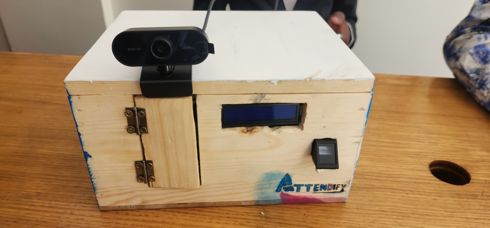
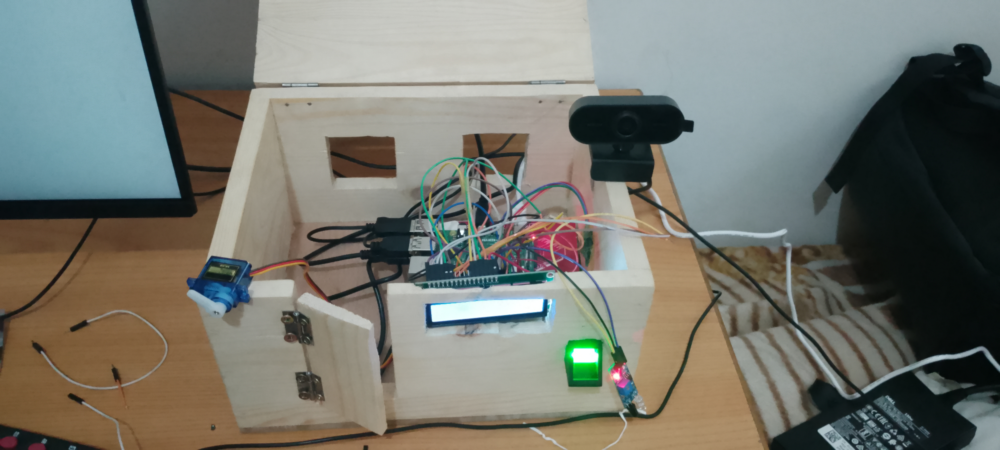
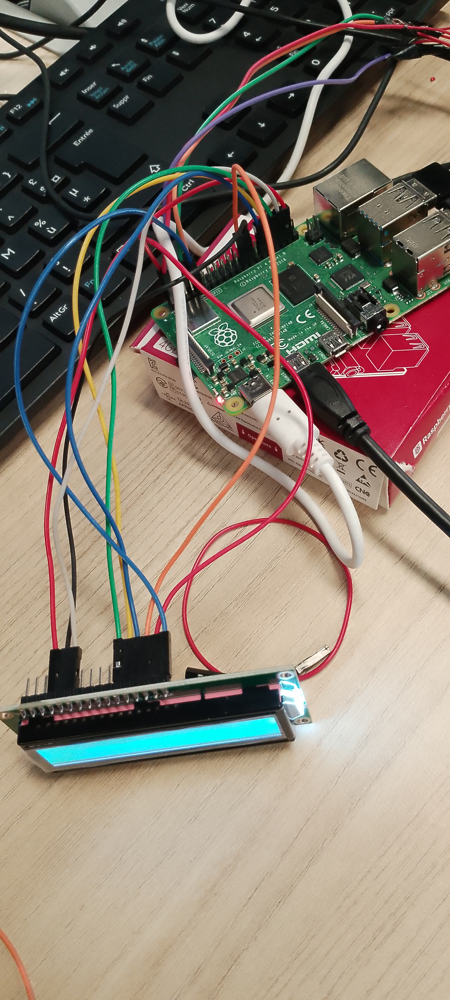

# RaspberryPi-Biometric-Attendance

> Smart Biometric Attendance System based on Raspberry Pi, Face Recognition and Fingerprint Authentication.


---

## Overview
<p align="center">

</p>
RaspberryPi-Biometric-Attendance is a smart attendance management system designed for classrooms and laboratories.

The system combines **face recognition**, **fingerprint authentication**, and **infrared motion detection** to securely identify users before granting access and automatically recording attendance.

Unlike traditional attendance methods such as paper sheets or RFID cards, this solution reduces fraud, saves time and provides reliable biometric identification.

---

## Features

- Face Recognition using OpenCV and Face Recognition library
- Fingerprint Authentication
- Infrared Presence Detection
- Automatic Door Control using Servo Motor
- LCD User Interface
- Cloud Attendance Logging (Airtable API)
- Raspberry Pi GPIO Control
- Multi-threaded Processing
- Automatic Attendance Recording

---

## System Workflow

1. Detect a person using the IR sensor.
2. Start biometric authentication.
3. Authenticate using either:
   - Face Recognition
   - Fingerprint Recognition
4. If authentication succeeds:
   - Unlock the door
   - Record attendance
   - Display a welcome message
5. If authentication fails:
   - Deny access
   - Display an error message

---

## Hardware Components

| Component | Description |
|------------|-------------|
| Raspberry Pi 4 | Main Controller |
| USB Camera | Face Recognition |
| R307 Fingerprint Sensor | Biometric Authentication |
| HC-SR501 IR Sensor | Presence Detection |
| SG90 Servo Motor | Door Lock Control |
| 16x2 LCD Display | User Interface |
| MicroSD Card | Local Storage |

---

## Software Stack

- Python
- OpenCV
- face_recognition
- RPi.GPIO
- RPLCD
- Airtable API
- Multithreading
- NumPy

---

## Project Structure

```
RaspberryPi-Biometric-Attendance
│
├── src/
├── images/
├── docs/
├── hardware/
├── models/
├── requirements.txt
├── README.md
└── .gitignore
```

---

## Installation

Clone the repository

```bash
https://github.com/kpoka-benjamin/RaspberryPi-Biometric-Attendance.git
```

Install dependencies

```bash
pip install -r requirements.txt
```

Configure your environment variables

```text
AIRTABLE_API_KEY=your_api_key
AIRTABLE_BASE_ID=your_base_id
AIRTABLE_TABLE_NAME=Attendance
```

Run the application

```bash
python src/main.py
```

---

## Project Images

### Inside View — Hardware Assembly

<p align="center">

</p>

### Wiring

<p align="center">

</p>

### System Architecture

<p align="center">

</p>


### Demo

[▶ Demonstration](Video.mp4)
---

## Security Notice

For privacy and security reasons, this repository **does not include**:

- Face encodings
- Fingerprint database
- Personal biometric data
- API keys
- Sensitive configuration files

Users must generate their own biometric database and configure their own cloud service credentials.

---

## Future Improvements

- Firebase Integration
- Mobile Application
- MQTT Communication
- OLED Display
- Voice Feedback
- Web Dashboard
- AI-based Analytics

---

## Author

**Benjamin KPOKA**

Electrical Engineering Student

Embedded Systems Enthusiast

Morocco

---

